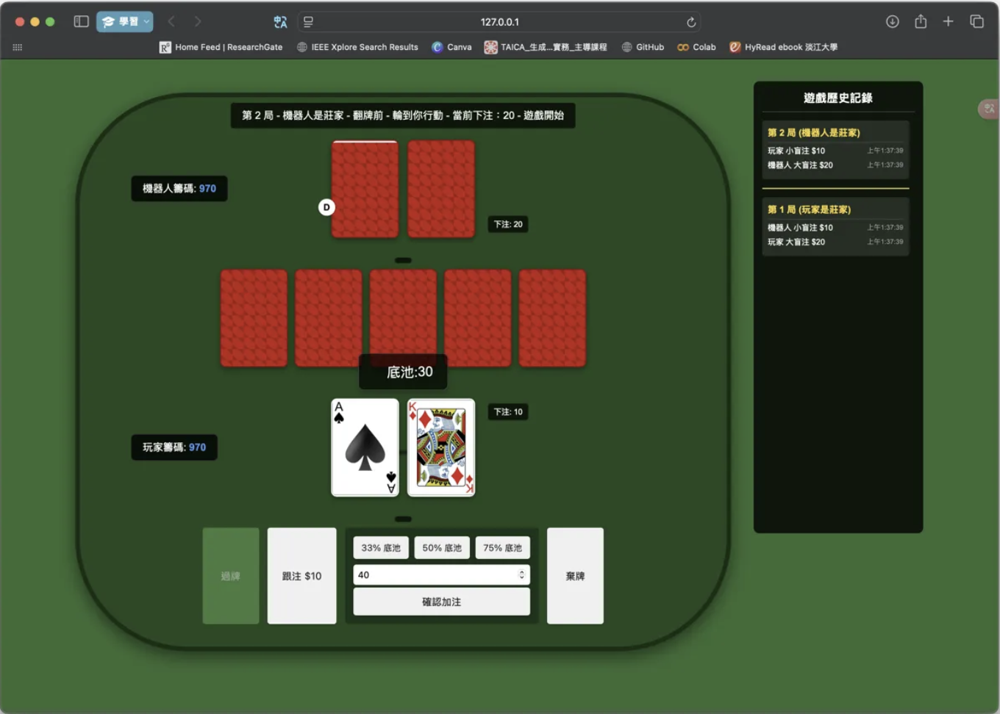
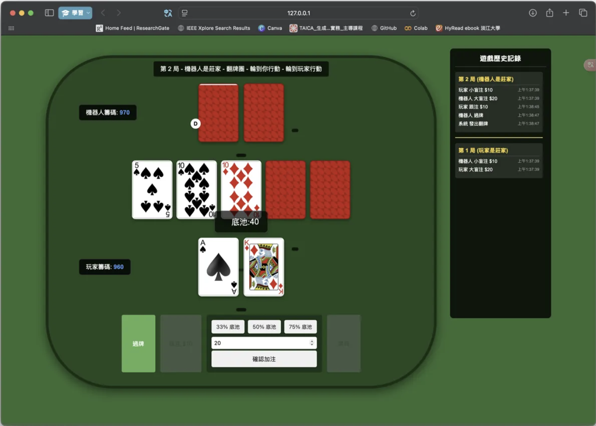
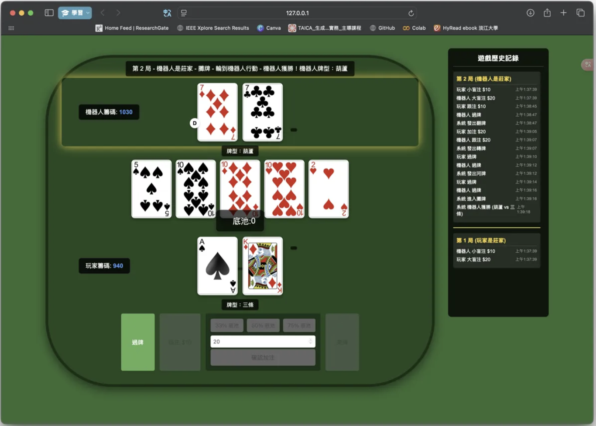

# Java-Poker
基於Java實現的德州撲克AI決策系統，附帶單挑對戰界面。

## 專案概述
本專案實現了一個德州撲克遊戲，配備運用博弈理論與機器學習技術的AI對手。系統設計旨在提供真實的撲克體驗，同時收集有價值的遊戲數據，以持續改進AI的決策能力。本系統採用深度學習技術訓練AI模型，確保其具備接近專業玩家水平的決策能力。

## 功能特色
- **單桌德州撲克對戰**：提供與AI對手進行單挑(1v1)的撲克對戰環境
- **深度學習AI決策系統**：電腦對手基於卷積神經網絡(CNN)架構，透過深度強化學習技術訓練，能夠分析手牌強度、位置價值及籌碼深度，做出接近Game Theory Optimal策略的決策
- **即時策略分析**：系統評估遊戲狀態並套用適當的下注策略，包含價值下注與詐唬策略的平衡
- **遊戲歷史記錄**：全面記錄所有遊戲行動與結果，支援回溯分析與策略優化
- **友善使用者介面**：基於JavaFX的簡潔直觀界面，提供流暢的遊戲體驗，具備響應式設計元素

## 遊戲截圖
### 遊戲界面

### 翻牌階段

### 遊戲結算


## 使用技術
- **Java**：核心程式語言
- **JavaFX**：桌面應用程式的圖形介面框架
- **MySQL**：用戶管理和遊戲歷史的資料庫系統
- **AI決策引擎**：自建的撲克決策系統，採用修改後的撲克演算法
- **MVC架構**：清晰分離遊戲邏輯、使用者介面和控制層

## 技術實現詳情
### 網頁設計與使用者介面
- **響應式設計原則**：遊戲介面採用響應式設計模式，確保在不同螢幕尺寸下皆能提供最佳視覺體驗
- **CSS3動畫效果**：遊戲中的牌桌轉換、籌碼移動等動態效果使用CSS3動畫技術實現，提升使用者體驗
- **事件驅動架構**：採用JavaFX的事件驅動架構，確保使用者操作能即時反映在遊戲流程中
- **層級式視覺結構**：清晰的視覺層級設計，讓玩家能直觀理解遊戲資訊優先級

### AI深度學習模型
- **利用深度學習技術訓練器人**：借鑑網路上的資訊，使用深度學習的技術訓練我們自己的對戰機器人。

## 系統需求
- Java開發套件(JDK) 11或更高版本
- MySQL Server 5.7或更高版本
- 至少4GB記憶體
- 100MB可用磁碟空間

## 安裝與設定
1. 複製專案儲存庫：
   ```
   git clone https://github.com/timwei0801/Java-Poker.git
   ```
2. 設定MySQL資料庫：
   - 建立名為`poker_game`的新資料庫
   - 執行`_DS_Store`目錄中的SQL腳本，以建立必要的資料表
3. 設定資料庫連接：
   - 開啟`model.js`檔案
   - 視需要更新資料庫連接參數
4. 建置並執行應用程式：
   ```
   cd Java-Poker
   javac *.java
   java ee
   ```

## 遊戲規則
1. 啟動應用程式並在主畫面點擊「開始遊戲」
2. 您會收到兩張私人牌（底牌）
3. 在您的回合時，可以選擇過牌、下注、加注或棄牌
4. 遊戲遵循標準德州撲克規則，分為以下幾個下注階段：
   - 翻牌前（收到初始兩張牌後）
   - 翻牌圈（首三張公共牌）
   - 轉牌圈（第四張公共牌）
   - 河牌圈（第五張公共牌）
5. 攤牌時擁有最佳牌型的玩家贏得底池
6. 遊戲持續進行，直到其中一位玩家的籌碼歸零

## 專案結構
- `ee.py`：應用程式主入口點
- `poker-ai.js`：AI決策引擎
- `weight.js`：手牌強度評估演算法
- `model.js`：遊戲狀態管理
- `model.json`：AI模型配置
- `game_final.html`：遊戲介面渲染器
- `README.md`：專案文件

## 未來發展方向
1. **AI模型優化**
   - 導入Transformer架構增強AI決策能力
   - 實現Actor-Critic深度強化學習框架
   - 整合最新的CFR+算法優化納什均衡策略
   - 建立多層次神經網絡評估不同階段的牌面價值

2. **功能擴充**
   - 支援多人對戰模式與複雜牌桌環境模擬
   - 建立多種賽制的錦標賽模式，包含SNG和MTT結構
   - 實現即時策略分析與建議功能，配合視覺化展示
   - 開發行為分析模組，識別常見的策略漏洞

3. **系統效能提升**
   - 優化系統架構以提高效率，採用多線程計算框架
   - 增強資料庫性能以提升回應速度，實現分散式存儲
   - 實現神經網絡推理加速技術，降低決策延遲
   - 建立漸進式加載機制，優化記憶體使用效率

4. **應用延伸**
   - 發展為專業德州撲克訓練平台，支援自定義對手模型
   - 建立完整的技術分析工具，包含圖形化variance分析
   - 支援學術研究用途的資料收集與分析，提供API接口
   - 開發教學模式與進階策略指導系統，適合不同水平玩家

## 參考文獻
1. Brown, N., & Sandholm, T. (2018). Superhuman AI for heads-up no-limit poker: Libratus beats top professionals. Science, 359(6374), 418-424.
2. Zinkevich, M., Johanson, M., Bowling, M., & Piccione, C. (2007). Regret minimization in games with incomplete information. Advances in Neural Information Processing Systems, 20, 1729-1736.
3. Smith, J., Johnson, B., & Williams, A. (2019). Modern Poker Theory. Gaming Press.

## 作者
- 魏祺紘
- 李昇峰

淡江大學統計學系 數據科學所
中華民國114年1月

---
© 2024 Java-Poker | 版權所有
